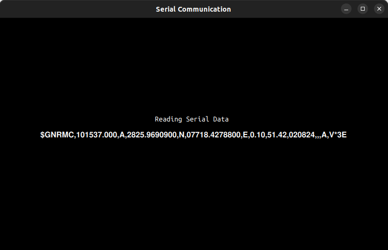

# SerialData-Qt

SerialData-Qt is a Qt Quick application that reads and writes serial data through serial ports. This project utilizes C++ and QML to provide an efficient and user-friendly interface for handling serial communication.

## Features

- **Serial Data Reading**: Reads data from serial ports and displays it in the UI as a single dialog showing the serial port data.
- **Baud Rate Configuration**: Change baud rate settings in `serial.cpp`.
- **Automatic Serial Port Detection**: Detects serial ports based on product manufacturer name.
- **Manual Port Entry**: Option to manually enter the port in `usbport` QString.
- **Error Handling**: Automatically reconnects and resumes reading data if the serial port disconnects.
- **Data Writing**: Write data to the same port using the `writeport` function.

## Screenshot

## Build and run the project:

-  Follow the usual steps in Qt Creator to build and run the project or cmake build.

## Usage

1. **Configure Baud Rate and Serial Port:**

    - Open `serial.cpp`.
    - Change the baud rate settings as needed.
    - Enter the product manufacturer name for automatic detection or manually set the port in the `usbport` QString.

2. **Run the Application:**

    - Execute the application to start reading serial data.
    - View the serial data in the UI as a single dialog showing the serial port data.
    - For more detailed information, check the terminal debug messages.
    - If the serial port disconnects, the application will wait for it to reconnect and resume reading data automatically.
    - Use the `writeport` function to write data to the same port.

## Contributing

Contributions are welcome! Please open an issue or submit a pull request for any improvements or bug fixes.

## Contact

For any questions or support, please contact [kunalf44@gmail.com](mailto:your-email@example.com).

